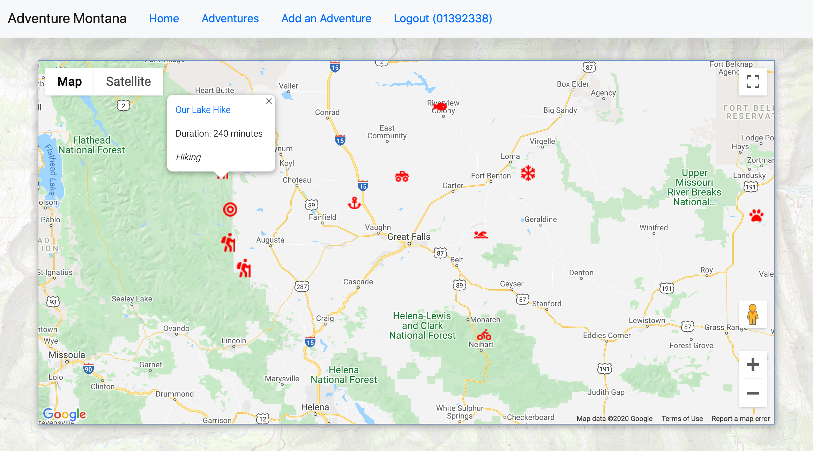
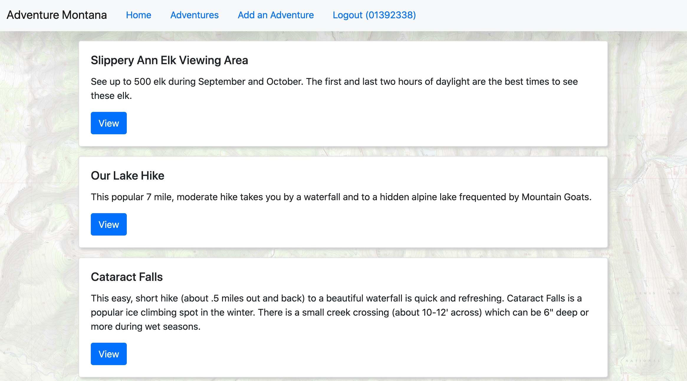
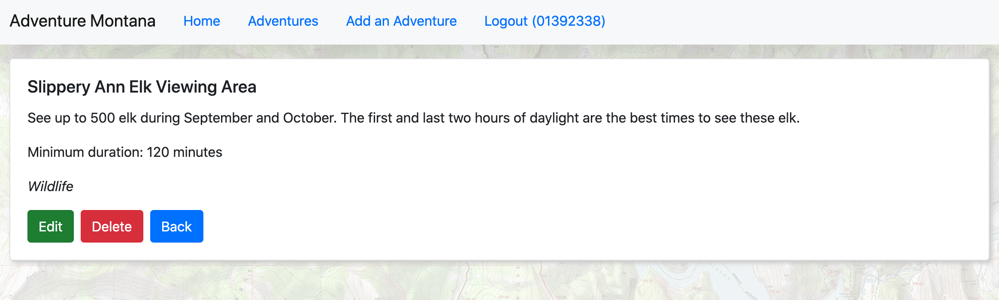

# <b>Adventure Montana</b>  
### <b>https://adventure-montana.netlify.app/ (live demo)</b>
---
#### Built with React, Redux, Node.js, Express, PostgresQL
---
   
   
   
---
This website allows a visitor to explore outdoor activities around Central Montana. The focus of this application is both the clean (clear documentation and testing) backend which is a RESTful API built using Node.js and Express. Middleware is used extensively for authentication, error handling, and message flashing.

The frontend is built using React and Redux and includes functionality to sync the Redux store to localStorage. A logged out user is free to explore the site while admin users can delete and edit adventures.

Feel free to experiment with our test login:  
Username:<code> testuser</code>  
Password:<code> password</code>

---
## <b>The tech stack used on this project includes:</b>
- HTML
- CSS
- JavaScript
- PostgresQL
- React
- Redux
- Node.js
- Express
- React Bootstrap
---
## <b>External APIs used in this project include:</b>  

<b>Google's Maps JavaScript API to generate a custom Google Map</b>  
https://developers.google.com/maps/documentation/javascript/tutorial

<b>Cloudinary's Upload API to host static images</b>   
https://cloudinary.com/documentation/image_upload_api_reference

---  
## <b>GitHub Links</b>   
<b>The GitHub repo for the frontend is:</b>
<https://github.com/FullStackJohnMack/JohnM-Capstone-Two>

<b>The GitHub repo for the backend is:</b>
https://github.com/FullStackJohnMack/JohnM-Capstone-Two-Backend